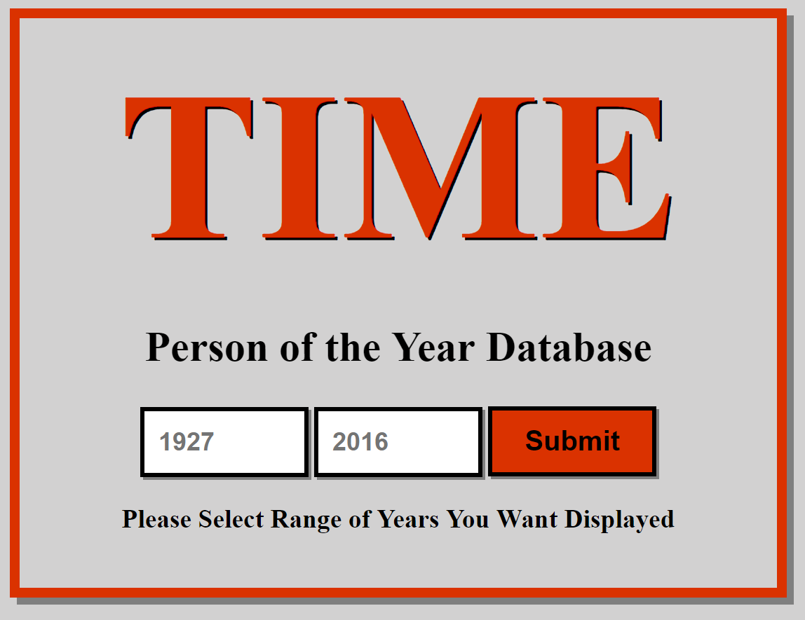
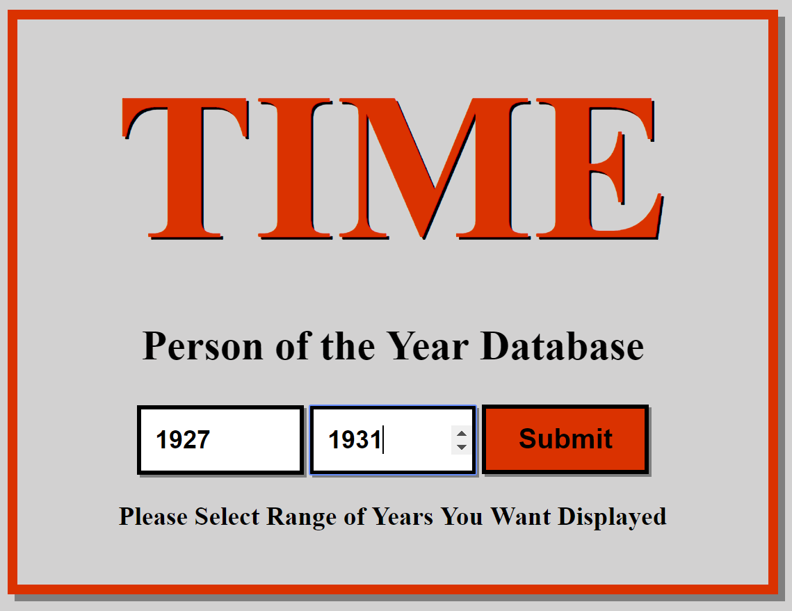
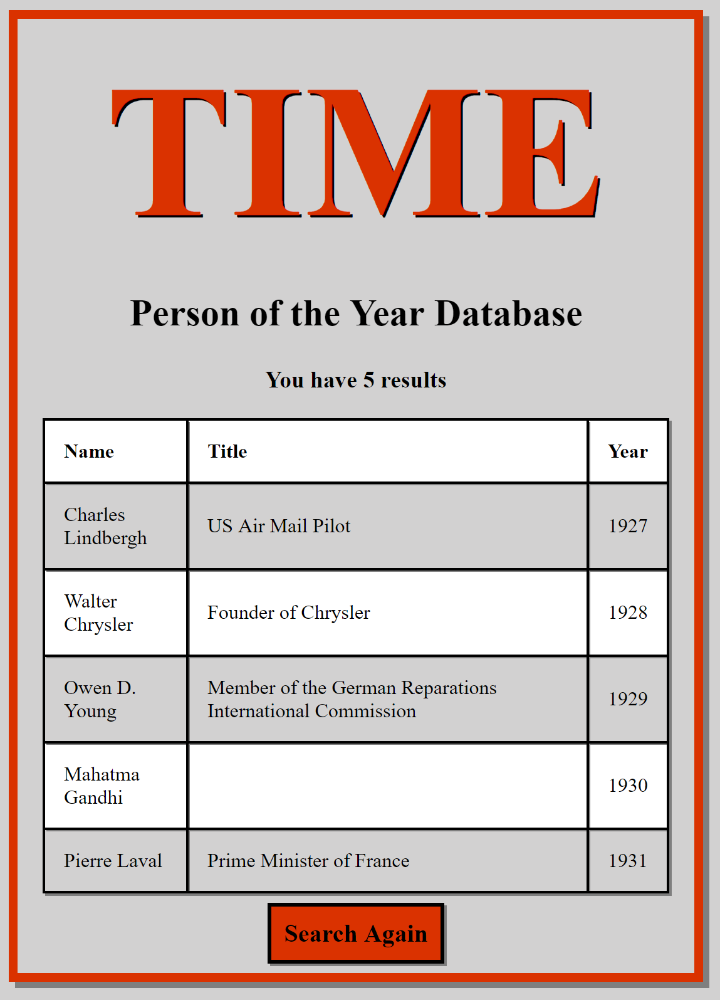

# Lab 11: My First MVC App
 
## Directions
- Read the instructions and website components, in it’s entirety, before beginning 
- Today you will be creating your first ASP.NET Core MVC web application. Provided is a csv file of all the “Time” Persons of the year from 1927 - 2016. Create a web app that will allow a user to put in a span of 2 different years, and a list of all the winners will be returned.
- Your web app should originate from an empty Web App template, with all controllers and views manually created, do not scaffold. If you are having trouble remembering the process to create a basic MVC app, refer to the Resources section below for assistance.

## Website Components

Your MVC Web Application should contain the following:

  - Add the MVC Middleware and include template routing (the route must be explicitly defined)
  - Only 1 controller. The home controller, with 3 actions (2 Index, and 1 Results)
       - Remember the difference between HTTPGET and HTTPPOST
       - Upon posting back to the server, call the Results action to redirect to the results view.
  - Views to generate the home page and search results
    - Use a form tag to accept user input
    - Use Tag Helpers to help redirect you from results page to the Home page. (HINT: the _ViewImports.cshml file may be required)
  - Include HTML/CSS in your final product. This is required.
    - It doesn’t have to be fancy, just make it look nice.
  - Enable use of Static Files in your website and create a style sheet and incorporate some creativity into your application.
  - A model class named TimePerson that contains the following properties(these are the headers of the csv file):
	- public int Year { get; set; }
	- public string Honor { get; set; }
	- public string Name { get; set; }
	- public string Country { get; set; }
	- public int BirthYear { get; set; }
	- public int DeathYear { get; set; }
	- public string Title { get; set; }
	- public string Category { get; set; }
	- public string Context { get; set; }

   - Create a static method within this model named GetPersons that brings in the range of years, and returns List< TimePerson >.
   - Create the internal logic to read in the file, filter the data from the given inputted range using LINQ queries and Lambda expressions, and return the final filtered list of persons.

   
## Resources
- MVC Setup https://codefellows.github.io/code-401-dotnet-guide/Curriculum/Class11/Resources/MVCSetup.html
- MVC Tutorial https://docs.microsoft.com/en-us/aspnet/core/tutorials/first-mvc-app/start-mvc?view=aspnetcore-2.2&tabs=visual-studio&viewFallbackFrom=aspnetcore-2.1

## Example Usage
### On Page Load
When the site loads you will see a window explaining the site and at the bottom of the page you will see a form that accepts years between 1927 and 2016.

    

### Conducting A Query
Enter in a year between 1927 and 2016 into each field and press submit.

Note: If the second number is less than the first number then you will be reset back to the initial form.

 

### Viewing Results
After the submit button is pressed you will see a table of results showing the name of the person of the year, that persons titles and the year that they were person of the year. Below the table you will see a Search Again button which when pressed will take you back to the initial form. 

 
